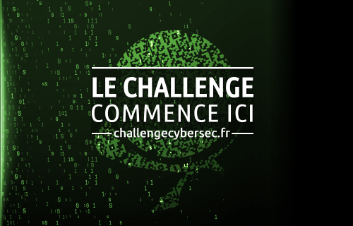

# Challenge Richelieu de la DGSE
https://www.challengecybersec.fr

## Le pitch

<!-- https://www.defense.gouv.fr/dgse/tout-le-site/le-challenge-richelieu-est-ouvert -->

<div align="center">
<!-- https://www.defense.gouv.fr/var/dicod/storage/images/base-de-medias/images/dgse-nouveau/challenge-richelieu/9669126-1-fre-FR/challenge-richelieu.jpg -->
<a href="https://www.challengecybersec.fr">

</a>
</div>
<br/>

_A l’occasion de notre présence au salon VivaTech 2019, la DGSE, a lancé son challenge sur le thème de Richelieu. Ce cardinal a, entre autre, participé à la naissance de la cryptanalyse des messages en France… Nous nous appuyons donc sur l’histoire pour vous challenger !_


_La création de la cryptologie serait en effet incomplète sans citer Richelieu qui, dès 1624, sut recruter les meilleurs spécialistes en mathématiques. Il a ainsi pu fonder, par la suite, ce qui est considéré aujourd’hui comme l’un des tous premiers bureaux du chiffre en Europe._


_Lors du siège de La Rochelle (1627-1628), la cryptanalyse des messages lui permit d’anticiper l’arrivée des Anglais, venus aider les insurgés par la mer. En octobre 1628, la ville finira par capituler sans condition._


_Pour réussir le challenge, il est nécessaire d’avoir un vaste panel de connaissances techniques notamment dans l’art du secret (cryptographie), de la dissimulation (stéganographie), de la programmation et surtout de la sécurité informatique._


_Alors n’attendez plus, testez vos connaissances et rejoignez-nous sur www.challengecybersec.fr_
</div>

Source: [Ministère des Armées](https://www.defense.gouv.fr/dgse/tout-le-site/le-challenge-richelieu-est-ouvert)


## Les étapes

1. analyser la page web pour obtenir un fichier PDF
2. extraire l'image JPEG en base64 contenue dans le PDF
3. séparer l'archive ZIP de l'image JPEG
4. extraire les fichiers de l'archive ZIP
5. reconstituer une clé RSA et décoder un fichier qui contient un mot de passe
6. décrypter un fichier qui contient une image PNG
7. stéganographier l'image pour extraire un fichier camouflé
8. décompresser l'exécutable ELF camouflé
9. rétro-ingéniérie de l'exécutable pour trouver le mot de passe
10. altérer le PATH pour accéder au fichier drapeau
11. provoquer un _buffer overflow_ pour accéder au fichier drapeau
12. corrompre le _heap_ pour accéder à la récompense

L'étape 1 requiert une connexion Internet pour télécharger un fichier. Le site est hébergé chez [OVH](https://www.ovh.com/fr/).

Les étapes 2 à 9 sont _offline_.

Les étapes 10 à 12 se passent en connexion SSH sur une machine distante (defi{1,2,3}.challengecybersec.fr) dont chaque connexion est isolée dans un _container_ Docker. Ces machines sont hébergées chez http://www.poneytelecom.eu (et oui, ce n'est pas une blague!) ou plus exactement chez [online](https://www.online.net/fr/). Cependant, ces étapes peuvent se préparer _offline_ une fois l'exécutable `prog.bin` récupéré.

<div style="font-style:italic;font-size:small;color:#ff4040">
Nota: cette découpe est personnelle et subjective.
</div>

## Les explications détaillées

* [étapes 1 à 8](challenge1/README.md)
* [étape 9](challenge2/README.md)
* [étape 10](defi1/README.md)
* [étape 11](defi2/README.md)
* [étape 12](defi3/README.md)

## Les outils utilisés

* [Linux Debian Stretch](https://www.debian.org/releases/stretch/)
* [Docker](https://docker.com)
* commandes Unix: bash, grep, chmod, sed, strings, file, xxd, hexdump, ssh, sl, cal, ...
* [curl](https://curl.haxx.se)
* [Python](https://www.python.org) 2 et 3
* [Poppler](http://poppler.freedesktop.org)
* [OpenSSL](http://openssl.org)
* [GnuPG](https://gnupg.org)
* [zsteg](https://github.com/zed-0xff/zsteg)
* [StegoVeritas](https://github.com/bannsec/stegoVeritas)
* [UPX](https://upx.github.io)
* [Ghidra](https://ghidra-sre.org)
* [gdb](https://www.gnu.org/software/gdb/), [ltrace](https://linux.die.net/man/1/ltrace), [objdump](https://linux.die.net/man/1/objdump)
* [gcc](https://gcc.gnu.org)
* [peda](https://github.com/longld/peda)
* [gef](https://github.com/hugsy/gef)
* [pwntools](https://github.com/Gallopsled/pwntools)
* [villoc](https://github.com/wapiflapi/villoc)

Ainsi que:

* [vim](https://www.vim.org)
* [Visual Studio Code](https://code.visualstudio.com)
* [git](https://git-scm.com)

## Le container Docker utilitaire

L'image Docker [dgse:stretch](docker/stretch/Dockerfiler) est une machine très proche de celles mises à disposition pour les défis. Il permet de tout lancer, quelque soit la machine hôte, les outils ci-dessus ainsi que les binaires `prog.bin` du challenge.

Pour créer l'image (donc le répertoire du `Dockerfile`):
```bash
docker build -t dgse:stretch .
```

Pour lancer le container:
```bash
docker run --name dgse --hostname dgse --rm -ti -v ~/dgse:/dgse --cap-add=SYS_PTRACE dgse:stretch
```

La _capability_ `SYS_PTRACE` est nécessaire pour gdb, strace, etc.

Pour ouvrir un deuxième terminal (`/dev/pts/1`) sur le même container:
```bash
docker exec -ti dgse bash
```

A adapter en fonction de l'emplacement du dépôt (`~/dgse` dans la commande ci-dessus).

Le script shell [dgse.sh](dgse.sh) est un wrapper à ces commandes.

## Imiter la plate-forme de CTF

### Le serveur SSH / hébergement des containers de CTF

[dgse:ctf-server](docker/ctf-server/README.md)

### Les containers de CTF

Les trois images `dgse:defi1` `dgse:defi2` `dgse:defi3` sont quasi similaires (même distro, mêmes packages, mêmes outils) que ce qui est mis à disposition pour le challenge. Voir [ici](docker/ctf/README.md).

---
*rene-d mai 2019*
