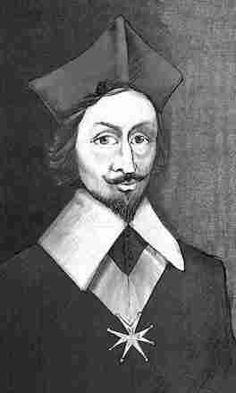
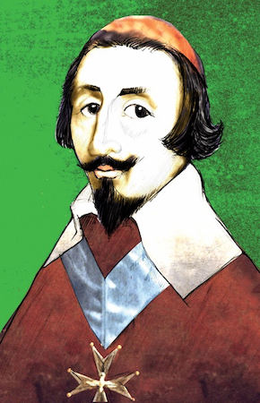

# Challenge Richelieu de la DGSE

https://www.challengecybersec.fr

Le challenge commence par un site web, avec la date de fin du challenge, un compte à rebours et une animation en Javascript (certes jolie mais qui occupe 100% de CPU).

## Sommaire

1. [Pour commencer](#Pour-commencer)
2. [Exploitation du document PDF](#Exploitation-du-document-PDF)
3. [Exploitation de l'image JPEG](#Exploitation-de-l'image-JPEG)
4. [Extraction des fichiers de l'archive ZIP](#Extraction-des-fichiers-de-l'archive-ZIP)
5. [Recherche de la clé privée RSA](#Recherche-de-la-clé-privée-RSA)
6. [Décryptage de l'image PNG](Décryptage-de-l'image-PNG)
7. [Analyse de l'image PNG](#Analyse-de-l'image-PNG)
8. [Extraction et décompression du programme ELF](#Extraction-et-décompression-du-programme)

## Exploit

Le script [exploit.sh](exploit.sh) enchaîne toutes les étapes décrites ci-dessous. Il nécessite une machine Linux ou un container Docker avec tous les outils installés.

## Pour commencer

Le menu _Afficher le code source de la page_ du navigateur ou
```
curl https://www.challengecybersec.fr
```
permet de voir le code source de la page.
On y trouve notamment le script suivant:
```javascript
let login = "rien";
let password = "nothing";
if (login === password) {
    document.location="./Richelieu.pdf";
}
```
ainsi que le nécessaire pour afficher le compte à rebours et l'animation.

Il s'agit donc d'une redirection non activée: il doit donc y avoir une ressource `Richelieu.pdf` sur le serveur.
```
curl -O https://www.challengecybersec.fr/Richelieu.pdf
```
permet de confirmer et de vraiment commencer le challenge.

Le PDF n'a qu'un texte visible, une introduction du challenge expliquant la référence à [Armand Jean du Plessis, cardinal de Richelieu](https://fr.wikipedia.org/wiki/Armand_Jean_du_Plessis_de_Richelieu).

### Texte d'introduction

>    Richelieu
>    L’histoire de la cryptologie serait incomplète sans citer Richelieu qui, dès 1624, sut recruter les meilleurs spécialistes en mathématiques. Il a ainsi pu fonder, par la suite, ce qui est considéré aujourd’hui comme l'un des tout premiers bureaux du chiffre en Europe.
>    Lors du siège de La Rochelle (1627-1628), la cryptanalyse des messages des Huguenots lui permit d’anticiper l’arrivée des Anglais venus aider ces derniers par la mer. En octobre 1628, la ville finira par capituler sans condition.

## Exploitation du document PDF

Il y a un texte non affiché, qu'on peut extraire avec [pdftotext](https://manpages.debian.org/stretch/poppler-utils/pdftotext.1.en.html) de [Poppler](https://poppler.freedesktop.org)
```bash
pdftotext Richelieu.pdf Richelieu.txt
```
Le fichier obtenu contient le paragraphe ci-dessus et du [base64](https://fr.wikipedia.org/wiki/Base64).

Pour le décoder, il faut supprimer le texte, les lignes vides et les ^L :
```bash
sed '1,8d;/^$/d;s/\x0c//' Richelieu.txt | base64 -d > data
```
La commande `file` identifie le fichier comme une image JPEG, de 6693178 octets. C'est d'ailleurs un portrait du cardinal.
```
$ file Richelieu.jpg
Richelieu.jpg: JPEG image data, progressive, precision 8, 2110x3508, frames 1
```



_One-liner_ :
```bash
pdftotext Richelieu.pdf - | sed '1,8d;/^$/d;s/\x0c//' | base64 -d > data
```

## Exploitation de l'image JPEG

Rien dans les tags de l'image. En revanche, un `strings data` laisser penser qu'il y a une archive ZIP cachée dans l'image.

Ceci est confirmé par une analyse [stéganographique](https://fr.wikipedia.org/wiki/Stéganographie) de l'image :
```bash
docker run -it --rm -v $PWD:/data bannsec/stegoveritas stegoveritas /data/data.jpg | more
```
Pour reconstituer l'archive ZIP de 6247550 octets (_one-liner_) :
```bash
docker run -it --rm -v $PWD:/data bannsec/stegoveritas stegoveritas /data/data.jpg | sed '8p;d' | python3 -c "import sys; open('data.zip','wb').write(eval(sys.stdin.read()))"
```

## Extraction des fichiers de l'archive ZIP

Cependant, `unzip` est capable de détecter lui-même le début de l'archive.
```
$ unzip -l data
Archive:  data
warning [data]:  445628 extra bytes at beginning or within zipfile
  (attempting to process anyway)
  Length      Date    Time    Name
---------  ---------- -----   ----
      578  2019-04-26 15:20   .bash_history
Le mot de passe
      331  2019-04-29 14:28   suite.zip
de cette archive
      868  2019-04-29 14:29   prime.txt
est : DGSE{t.D=@Bx^A%n9FQB~_VL7Zn8z=:K^4ikE=j0EGHqI}
      800  2019-04-29 14:29   public.key
      512  2019-04-29 14:29   motDePasseGPG.txt.enc
  6243231  2019-04-29 14:29   lsb_RGB.png.enc
---------                     -------
  6246320                     6 files
```

Il y a un texte qui a été rajouté dans les commentaires de fichiers:
```
Le mot de passe de cette archive est : DGSE{t.D=@Bx^A%n9FQB~_VL7Zn8z=:K^4ikE=j0EGHqI}
```

Il faut donc utiliser le mot de passe pour extraire les fichiers de l'archive avec `unzip`:
```bash
unzip -P 'DGSE{t.D=@Bx^A%n9FQB~_VL7Zn8z=:K^4ikE=j0EGHqI}' data
```

Le fichier `suite.zip` doit donner la suite du challenge. Il est protégé par mot de passe, et c'est ce mot de passe qu'il faut trouver.

La lecture du fichier `.bash_history` laissé à escient indique l'ordre des opérations :
```bash
 1337  gpg -o lsb_RGB.png.enc --symmetric lsb_RGB.png
 1338  vim motDePasseGPG.txt
 1339  openssl genrsa -out priv.key 4096
 1340  openssl rsa -pubout -out public.key -in priv.key
 1341  openssl rsa -noout -text -in priv.key | grep prime1 -A 18 > prime.txt
 1342  sed -i 's/7f/fb/g' prime.txt
 1343  sed -i 's/e1/66/g' prime.txt
 1344  sed -i 's/f4/12/g' prime.txt
 1345  sed -i 's/16/54/g' prime.txt
 1346  sed -i 's/a4/57/g' prime.txt
 1347  sed -i 's/b5/cd/g' prime.txt
 1348  openssl rsautl -encrypt -pubin -inkey public.key -in motDePasseGPG.txt -out motDePasseGPG.txt.enc
 ```

 Ainsi :
* `lsb_RGB.png.enc` est crypté par [GnuPG](https://gnupg.org) avec un mot de passe qui doit être dans `motDePasseGPG.txt.enc`. Le mot de passe de `suite.zip` est certainement caché dans le PNG.
* `motDePasseGPG.txt.enc` est crypté par [OpenSSL](https://www.openssl.org) avec la clé publique fournie dans `public.key` et requiert pour être décrypté une clé privée dont `prime.txt` est une version altérée.

## Recherche de la clé privée RSA

Une clé privée RSA est composée de 9 éléments selon la [RFC 2313](https://www.ietf.org/rfc/rfc2313.txt) :
1. version: `0`
2. modulus: donné par `openssl rsa -pubin -in public.key -text -noout`
3. publicExponent: _65537_
4. privateExponent: modular inverse _(prime1-1)(prime2-1)_ modulo _publicExponent_
5. prime1: à trouver à partir des subsitutions faites par `sed` dans `prime.txt`
6. prime2: _modulus / prime1_
7. exponent1: _privateExponent mod (prime1 - 1)_
8. exponent2: _privateExponent mod (prime2 - 1)_
9. coefficient: Chinese Remainder Theorem coefficient _prime2-1 mod prime1_

Le `.bash_history` a révélé 6 modifications par `sed` dans le fichier `prime.txt`. Il faudra en tenir compte lors de la recherche de _prime1_.

Le script Python `findkey.py` rassemble toutes les étapes de recherche et de calculs mathématiques pour reconstituer la clé privée dans le fichier `priv.key`.

La commande OpenSSL suivante permet de décrypter `motDePasseGPG.txt.enc` :
```bash
openssl rsautl -decrypt -inkey priv.key -in motDePasseGPG.txt.enc
```

Le mot de passe est donc:
```
DGSE{Ti,%yei3=stlh_,5@pIrrMU.^mJC:luYbt1Qe_-Y}
```

## Décryptage de l'image PNG

`lsb_RGB.png.enc` est décrypté avec le mot de passe précédemment trouvé et la commande suivante :
```bash
gpg --batch --passphrase 'DGSE{Ti,%yei3=stlh_,5@pIrrMU.^mJC:luYbt1Qe_-Y}' --yes  --output lsb_RGB.png --decrypt lsb_RGB.png.enc
```
Le fichier est effectivement une image PNG, de 6228328 octets.

Sans surprise, il s'agit encore de Richelieu, dessin à l'origine inconnue, comme la première image d'ailleurs.



## Analyse de l'image PNG

Une recherche "lsb rgb png" avec Google renvoie des liens de stéganographie. De plus la stéganographie est mentionnée dans le pitch du challenge. Il va falloir déterminer quelle méthode a été utilisée. Un [site](https://k-lfa.info/tools-stegano/) liste des outils d'analyse. On va utiliser `zsteg` pour trouver l'encodage, en se limitant aux channels RGB et _least significant bit_ (indications du nom de fichier).
```bash
zsteg --all --channels rgb --lsb lsb_RGB.png
```

## Extraction et décompression du programme

C'est donc un binaire ELF qui est caché dans l'image, selon le schéma `b1,rgb,lsb,yx`. Malheureusement `zsteg` rajoute du bruit à la fin du fichier extrait, qu'il faut supprimer avant de convertir en binaire avec `xxd -r`.

Un coup de `strings` fait ressortir la chaîne de caractères suivante :
```
$Info: This file is packed with the ALD executable packer http://upx.sf.net $
```
C'est évidemment `...the UPX executable packer...`. On va changer ALD (_AttrapeLeDrapeau_ !) en UPX.

```bash
zsteg --extract b1,rgb,lsb,yx lsb_RGB.png > extract.hex
cat extract.hex | tr -cd '[:print:]\n' | grep "^00......: " | xxd -r | sed 's/ALD/UPX/g' > prog.bin
upx -d prog.bin
chmod a+x prog.bin
```

On obtient finalement un exécutable `prog.bin` de 297492 octets.

Ce programme vérifie un mot de passe (celui de `suite.zip`): c'est un _cracke-me_.


[Suite...](../challenge2/README.md)

---
*rene-d 23 mai 2019*
