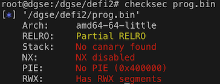

# Challenge Richelieu de la DGSE - défi 2

https://www.challengecybersec.fr

## Pour se connecter à la machine du défi
```
ssh defi2.challengecybersec.fr -l defi2 -p 2222

mot de passe : DGSE{H#M?W)el{0YZ-)77/C#ogrp}k4&EbP}
```
(`drapeau.txt` du [défi 1](../defi1/README.md))

## Le challenge

Comme le défi 1, c'est un CTF: un programme _setuid_ doit être détourné pour lire un fichier accessible uniquement par l'utilisateur à qui appartient le programme.

On récupère `prog.bin` de la même manière que le [défi 1](../defi1/README.md#Note). Et on le donne à manger à [Ghidra](https://ghidra-sre.org).

## La vulnérabilité

La lecture du code source montre un appel `scanf()` (_qui est un nid à bugs_) avec `%s` comme format avec un buffer destination de 48 octets.

On aurait pu également utiliser `ltrace` pour analyser les appels système.

Le `scanf()` est utilisé pour lire le mot de passe. La vulnérabilité est là. Et l'angle d'attaque un mot de passe de plus de 48 octets.

De plus `checksec` permet de vérifier que la stack est exécutable.



## L'attaque

### Provoquer un buffer overflow

Lorsque `scanf()` va stocker la chaine de caractères dans `password` (cf. [saisie()](defi2.c)), si la longueur est supérieure à 48, la fonction va écraser la pile (i.e. écrire des octets là où elle ne devrait pas).

Lors du retour de la fonction, le processeur va exécuter `leave` et `ret`.

Pour un processeur 64 bits (où les registres et les adresses font 8 octets):
* `leave` (opcode `C9`) va copier `rbp` (_le registre de sauvegarde du pointeur de pile_) dans `rsp` (_le pointeur de pile_) puis dépiler `rbp` (i.e. mettre dans `rbp` le mot à l'adresse `rsp` et incrémenter `rsp` de 8)
* `ret` (opcode `C3`) va dépiler `rip` (i.e. mettre dans `rip` le mot à l'adresse `rsp` et incrémenter `rsp` de 8, l'exécution se poursuit à l'adresse contenue dans `rip`)

Ainsi, en écrivant 16 octets en plus de les 48 octets autorisés, les 8 premiers vont aller dans rbp et le 8 suivants dans `rip`. On peut contrôler ainsi le déroulement du programme.

### Exécuter notre code

[ASLR](https://fr.wikipedia.org/wiki/Address_space_layout_randomization) étant activé au niveau du système, on ne contrôle pas les adresses.

La technique est de trouver un _gadget_ (i.e. un bout de code qui se termine par un saut) pour se diriger vers notre _shellcode_ (le code qui va s'exécuter avec l'élévation de privilèges).

```bash
root@dgse:/dgse/defi2# ropper -f prog.bin
...
0x0000000000400605: jmp rax;
...
126 gadgets found
```

Il faut que le _gadget_ respecte certaines conditions dûes à `scanf()`: son adresse ne doit pas avoir `0x20` ou `0x0A` (sinon `scanf()` s'arrête).

### La stack

Voici l'état de la pile dans la fonction `saisie()`.

_Attention, compte tenu de l'ASLR, les adresses varient à chaque lancement._

```
                         rsp
                    --------------
                    0x7fff64509e88  adresse retour après call main(), utilisée par ret
                    0x7fff64509e80  sauvegarde rbp
pile de main() ---->
(0x410 octets)      0x7fff64509e78  char *login                         0x0
                    0x7fff64509a70  char buffer[1032]                   "login"

<<< appel de la fonction saisie() à 0x40086d >>>

                    0x7fff64509a68  adresse retour après call saisie()  0x400970
                    0x7fff64509a60  sauvegarde de rbp                   0x7fff64509e80
pile de saisie() -->
(0x40 octets)       0x7fff64509a30  char password[48]                   "password"
                    0x7fff64509a28  sauvegarde de (char *buffer)        0x7fff64509a70
                    0x7fff64509a20  inutilisé
```

Ainsi, il y a :
* `0x7fff64509a70 - 0x7fff64509a30` = 64 octets entre `password` et `login`
* `0x7fff64509a68 - 0x7fff64509a30` = 56 octets entre `password` et l'adresse de retour à la sortie de `saisie()`

### Pas-à-pas

Le buffer overflow va écrire dans ce qu'il y a au-dessus dans la pile, à savoir le buffer de 1032 octets `buffer` de la fonction `main()`.

Ainsi, les octets 64 et suivants du password vont se retrouver dans le login.

A la sortie de la fonction de saisie `saisie()`, `rax` est chargé avec le pointeur du buffer du login (cf. `return buffer;`)

Le `leave` va sauter les octets 48 à 55 octets du password (la sauvegarde de `rbp`).

Le `ret` va exécuter l'instruction à l'adresse donnée par les octets 56 à 63 du password (l'adresse de retour après `call saisie`), i.e. notre _gadget_ `jmp rax`.

A l'adresse pointée par `rax` (le buffer du login), on a écrit `jmp +6` grâce au buffer overflow.

On saute donc au 11ème (5 de opcode + 6) octet du login, qui contient le _shellcode_. Pourquoi 11? parce que le login est tronqué à 10 caractères par le code. Le fait de mettre le _shellcode_ dans le login évite les difficultés du au troncage éventuel effectué _après_ le `scanf()` et `fgets()` est moins sensible à certains caractères (les espaces) que `scanf()`.

Le _shellcode_ va charger l'adresse dans la table de relocation de `puts` (obtenue avec `objdump -R prog.bin`).

Puis soustraire `0x29b10` qui est la différence entre `system()` et `puts()` (déterminée avec gdb, objdump, ou automatiquement avec [pwntools](https://github.com/Gallopsled/pwntools)). A ce moment `rax` pointe sur la fonction `system()` de la libc.

On met dans `rdi` l'adresse qui suit le `jmp rax`, à savoir `rip+2`.

Et après ce `jmp rax`, on place la chaîne de caractère qu'on veut passer à `system()`.

Et le tour est joué :)

Le programme plante après, mais ce n'est pas grave, on a capturé le drapeau.

### Comprendre avec gdb

Le fichier `.gdbinit` créé par le script [response.py](response.py) qui prépare l'attaque permet de suivre pas-à-pas le buffer overflow.

Au premier breakpoint, on est avant `fgets()`. Faire `ni` pour voir le login lu. Puis `c`.

Au deuxième breakpoint, on est avant `scanf()`. Faire `ni` pour voir le password lu (et constater les dégâts dans la pile). Puis `c`.

Au troisème breakpoint, on est au moment du `ret`. Faire `si` jusqu'au `call rax`. On arrive à l'appel de `system()`.

## Le drapeau

```
Suite du challenge Richelieu :

ssh defi3.challengecybersec.fr -l defi3 -p 2222

mot de passe : DGSE{?uo20tPO4(o=A=dX3njr2y{emZQodR}
```

[Suite...](../defi3/README.md)

---
*rene-d 27 mai 2019*
