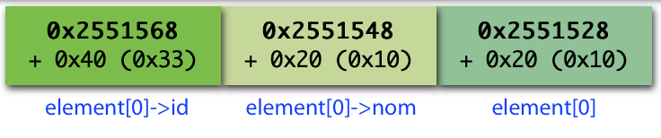
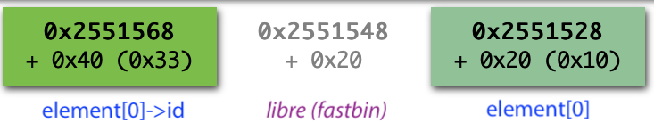
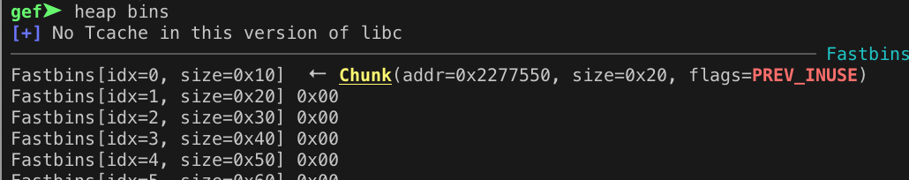
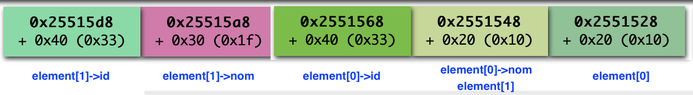

# Challenge Richelieu de la DGSE - défi 3

https://www.challengecybersec.fr

## Pour se connecter à la machine du défi

```
ssh defi3.challengecybersec.fr -l defi3 -p 2222

mot de passe : DGSE{?uo20tPO4(o=A=dX3njr2y{emZQodR}
```
(`drapeau.txt` du [défi 2](../defi2/README.md))

## Le challenge

```
defi3@AttrapeLeDrapeau:~$ ls -al
total 44
drwxr-xr-x 1 defi3         defi3          4096 May 10 11:09 .
drwxr-xr-x 1 root          root           4096 May 10 11:09 ..
-rw-r--r-- 1 defi3         defi3           220 May 15  2017 .bash_logout
-rw-r--r-- 1 defi3         defi3          3526 May 15  2017 .bashrc
-rw-r--r-- 1 defi3         defi3            32 May 10 11:09 .gdbinit
-rw-r--r-- 1 defi3         defi3           675 May 15  2017 .profile
-rw-r--r-- 1 defi3         defi3             7 May 10 11:09 .vimrc
-r-------- 1 defi3-drapeau defi3-drapeau   564 Apr 29 15:43 drapeau.txt
-r-sr-sr-x 1 defi3-drapeau defi3-drapeau 10392 May 10 11:09 prog.bin
```

```
defi3@AttrapeLeDrapeau:~$ ./prog.bin
***************************************************
***    Bienvenue dans la gestion d'éléments     ***
***                                             ***
***   NB : Taille de l'ID : 50 octets           ***
***        Vous pouvez mettre la taille         ***
***        en paramètre pour la changer         ***
***************************************************
Que voulez-vous faire ?
  -> 1) nouvel élément
  -> 2) affichage
  -> 3) détruire un élément
  -> 4) changer de nom
  -> 5) changer d'id
  -> 6) sortie
choix $
```

Le but est de faire faire un `cat drapeau.txt` à `./prog.bin`. C'est un [CTF](https://en.wikipedia.org/wiki/Capture_the_flag#Computer_security) classique basé sur l'exploitation du heap avec un ["use after free" (UAF)](https://cwe.mitre.org/data/definitions/416.html) d'un [dangling pointer](https://en.wikipedia.org/wiki/Dangling_pointer#Security_holes_involving_dangling_pointers).

## Principe de l'attaque

## Etude

[Ghidra](https://ghidra-sre.org) permet de reverse-engineer le programme. Comme il est selon toute vraisemblance écrit en C, c'est très facile de reconstituer le code source, à l'identique ou presque.

### La vulnérabilité

Elle peut être déterminée d'au moins deux manières différences :
* en suivant les malloc/free avec [ltrace](http://linux.die.net/man/1/ltrace)
* en étudiant le code source

Les éléments sont stockés dans une structure similaire à celle-ci:
```C
struct element {
    char *nom;      // malloc selon la longueur du nom
    char *id;       // malloc de taille fixe (50 par défaut)
};
```

Les chaînes de caractères sont lues avec `fgets()` (donc avec contrôle de longueur), les `strcpy()` ne peuvent également pas dépasser (même celui ligne 199...).

En revanche les allocation/désallocation sont mal gérées.

### L'attaque en six étapes

#### étape 1
Allouer un élément de manière à ce que le `malloc()` de `nom` soit de même taille que le `malloc()` de `struct element` (soit `0x10` octets)

On aura en mémoire trois chunks (en plus des chunks déjà alloués):



#### étape 2
Détruire le nom (menu option 3). Cela va faire un `free()` sur le nom et mettre le chunk (`02551548` dans l'exemple ci-dessus obtenu avec [villoc](https://github.com/wapiflapi/villoc), `0x2277550` dans la session gdb ci-dessous) dans la liste des *fastbins* de malloc, avec la commande [heap bins](https://gef.readthedocs.io/en/latest/commands/heap/) de [GEF](https://github.com/hugsy/gef).





#### étape 3
Créer un nouvel élément. Le `malloc(sizeof(struct element))` va réutiliser le chunk libéré et on va pouvoir jouer avec les pointeurs via le changement de nom (menu option 4).



#### étape 4
On met comme nouveau nom les octets qui correspondent à l'entrée de `free()` dans la table de relocation. `0x602018` est ok: pas de `\n`, pas de `\0`.

Cette adresse peut s'obtenir automatiquement dans un script Python avec [pwntools](https://github.com/Gallopsled/pwntools#readme) :
```python
velf = ELF("./prog.bin")

free_got = velf.got['free']
```
ou en ligne de commandes avec [objdump](https://linux.die.net/man/1/objdump) :
```
defi3@AttrapeLeDrapeau:~$ objdump -R prog.bin

...
0000000000602018 R_X86_64_JUMP_SLOT  free@GLIBC_2.2.5
...
```

L'affichage va nous donner l'adresse effective de `free()` dans la libc. Comme [ALSR](https://fr.wikipedia.org/wiki/Address_space_layout_randomization) est activé, celle-ci change à chaque fois.

Elle est de la forme `0x00007f735fa1c510` et correspond à l'entrée `__libc_free` de `/lib/x86_64-linux-gnu/libc.so.6`.

#### étape 5

A partir de l'adresse de `free()`, on calcule l'adresse de `system()` :
```python
libc = ELF("/lib/x86_64-linux-gnu/libc.so.6")

offset_free_system = libc.symbols['free'] - libc.symbols['system']
system_addr = free_addr - offset_free_system
```

#### étape 6
On écrit l'adresse de `system()` à la place du nom du deuxième élément. Son adresse en fait est l'entrée de `free()` dans la [GOT](https://en.wikipedia.org/wiki/Global_Offset_Table) telle qu'elle a été positionnée lors de l'étape 2.

Ainsi au lieu d'appeler `free()`, le programme va appeler `system()` !

Il suffit alors de demander la destruction de l'`id` de l'élément 0, dans lequel on aura placé `cat drapeau.txt` (ou `chmod 666 drapeau.txt`).

## Le drapeau
```
Félicitations à vous, vous avez réussi l'intégralité du challenge Richelieu organisé par la DGSE !
Vous avez la perspicacité et le profil pour relever les défis technologiques au sein de nos équipes.

Dès maintenant, vous pouvez envoyer le tag [Y2hhbGxlbmdlLVJpY2hlbGlldQ==] accompagné, si vous le souhaitez, d'un CV et d'une lettre de motivation à l'adresse suivante : dgse-macandidature.cer.fct@intradef.gouv.fr.

Pour vous renseigner sur les métiers que nous recherchons : https://www.defense.gouv.fr/dgse/tout-le-site/nos-besoins-en-recrutement.
```

## Lectures

* [CWE-416: Use After Free](https://cwe.mitre.org/data/definitions/416.html)
* [Heap Exploitation](https://heap-exploitation.dhavalkapil.com)
* [Writeup CTF RHME3: exploitation](https://ktln2.org/2017/08/31/rhme3-exploitation-writeup/)

---
*rene-d 29 mai 2019*
